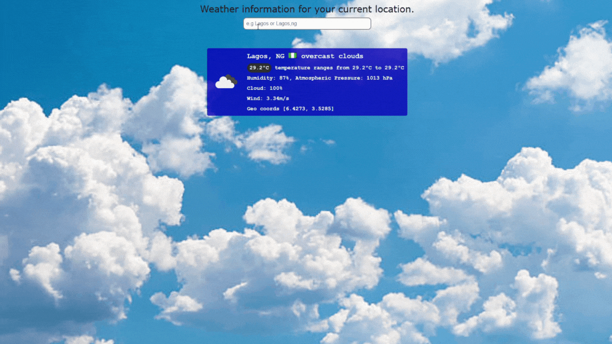

# Weather App

This repository contains files for a simple weather application that displays weather information based on the user's current location or a searched location. The application is built using HTML, CSS, and JavaScript.

## [Live Demo](https://weather-app-davidomotoso.vercel.app/)



## Files

- index.html: This HTML file contains the structure and content of the weather application. It includes a search section for entering a location and a weather information section for displaying the weather data.

- Weather app.css: This CSS file provides the styling for the weather application. It defines the layout, colors, and fonts used in the application.

- Weather app.js: This JavaScript file contains the logic for retrieving weather data from the OpenWeatherMap API and updating the weather information displayed in the application. It also includes functions for converting temperature units and handling user interactions.

## Installation

Clone the repository into your local machine using the following command:

```
git clone https://github.com/davidomotoso/Weather-app.git
```

## Usage

To use the weather application, simply navigate to the Weather app folder then, open the index.html file in a web browser. The application will attempt to retrieve weather data for the user's current location automatically. Alternatively, you can enter a location in the search input to fetch weather information for that specific location.

## Dependencies

The weather application relies on the following dependencies:

- OpenWeatherMap API: The application uses the OpenWeatherMap API to retrieve weather data. It requires an API key, which should be stored in the apiKey variable defined in the JavaScript file.

## Customization

You can customize the appearance of the weather application by modifying the CSS styles in the Weather app.css file. Additionally, you can enhance or modify the functionality of the application by editing the JavaScript code in the Weather app.js file.

Please note that modifying the JavaScript code may require familiarity with web development and API integration.

## Attribution

The weather application utilizes the following resources:

- Favicon image : The favicon image used in the application is sourced from [flaticon](https://www.flaticon.com/) and can be found at the following URL: [Sunset](https://www.flaticon.com/free-icon/sunset_10132764?term=sunset&page=1&position=13&origin=tag&related_id=10132764). The icon was made by [LogisStudio](https://www.flaticon.com/authors/logisstudio)

- Background Image: The background image used in the application is sourced from [iStockphoto](https://www.istockphoto.com/) and can be found at the following URL: [Clouds on Sky](https://media.istockphoto.com/id/184103864/photo-clouds-on-sky.jpg?s=612x612&w=0&k=20&c=3JGI13B8xwZIObLtl8IN1VFtPErHv2pKiWV0tTuemsI=).

- OpenWeatherMap: Weather data is retrieved from the OpenWeatherMap API. For more information, visit their website: [OpenWeatherMap](https://openweathermap.org).

## Disclamier

The weather application is provided as-is without any warranty. The accuracy and availability of weather data depend on the OpenWeatherMap API service. OpenWeatherMap's terms and conditions apply to the usage of their API.

Please use the weather application responsibly and respect the usage limits and terms of service of the OpenWeatherMap API.
